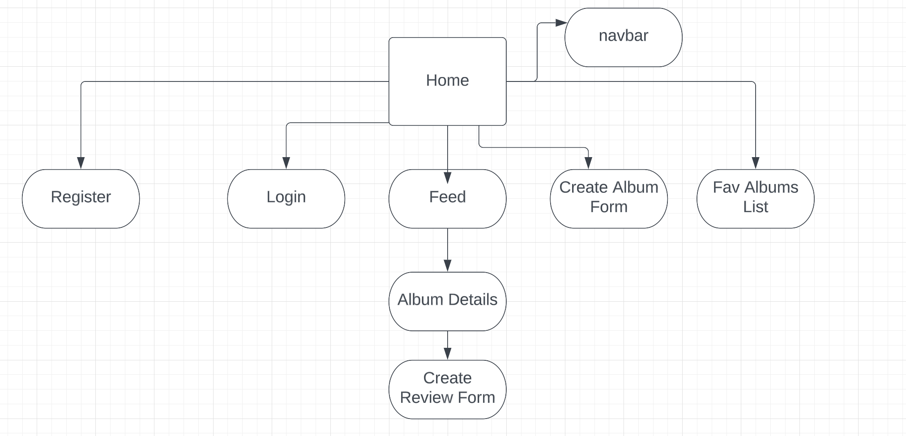
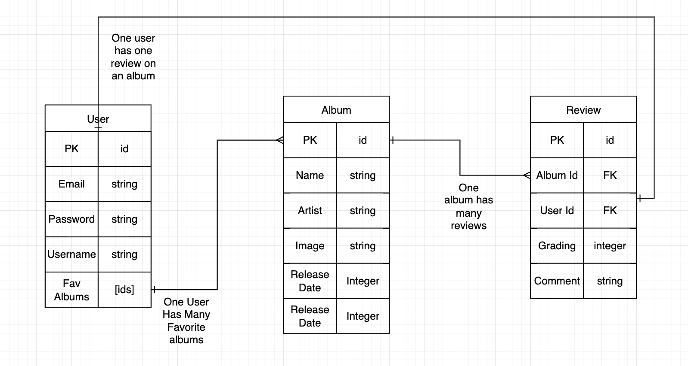

# TurnTables

## **3/02/2023**

#### [Jon Lindner ](https://www.linkedin.com/in/jon-lindner-807847183/) | [Noah Vaughn](https://www.linkedin.com/in/noahvaughn/) | [Sarah Maher](https://www.linkedin.com/in/sarah-maher-8a6865255/?original_referer=https%3A%2F%2Fgithub.com%2Fmartinsliz%2FTheme-Park-Haters%2Fedit%2Fmain%2FREADME.md)

#### [Front End Repository](https://github.com/jonclindner/TurnTables) | [Back End Repository ](https://github.com/jonclindner/TurnTables-Backend) | [Trello](https://trello.com/b/kEiMJIBB/turntables)

---

## **_Description_**

#### Week eight project at General Assembly.

#### TurnTables is a scratch-built, full-stack application which utilizes user authenticaiton to allow users to rank, comment, and review thier favorite albums.

####

---

### **_*Technologies Used*_**

- Postgres
- Express
- React
- Node

---

### **_Getting Started_**

#### Component Heirerachy Diagram:

#### 

#### Entity Relationship Diagram:

#### 

### **Objective**

###

### **Flow**

###

---

##

---

### **_Screenshots_**

---

---

## **Credits**
